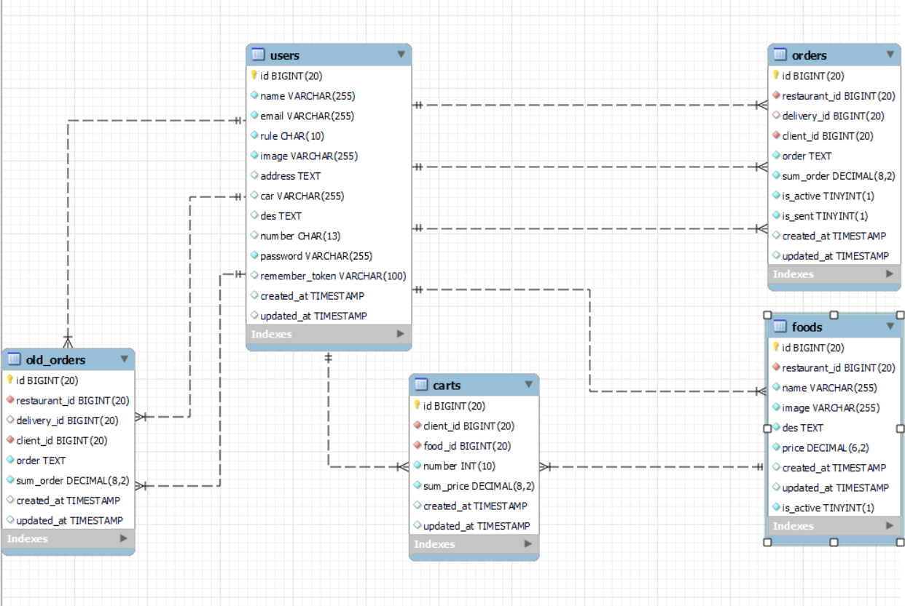

# Food Delivery

Youtube video (without vue and admin panel): <https:/youtu.be/R4qfJx9RGv4>

## Project Idea

> My project is a food delivery app where there are three types of users client, delivery ,restaurant. Each user type has its own app,
> So users can browse the foods provided by the restaurant and place an order, then delivery can accept the order,
> then the restaurant can view the order after delivery accepts it.

## Data base schema and data flow

> In this section I am gonna talk about the schema of the data base and how data moves from table to table.
>
> Check this image for schema:
>
> 
>
> so the client starts browsing food (from the foods table that's connected to the restaurant), then adds food to the cart (cart table), then he can place
> order. When a client places order cart become big string including how many of the food and the name of it, so it moves to the order table,
> order table is connected to 3 types of users, delivery will be null, tell delivery accept it, and restaurant, client will be assigned, then
> client can send order (is_send become true) so delivery can see all orders sent by clients, then delivery can accept order, when delivery
> accept order (is_active become true) delivery information will go to client, and order information will go to restaurant, finally when delivery
> deliver the order, order will move to old orders table which is similar to order table.

## Middle wares

> there is 3 custom middle wares in the project:
>
> 1. [MustBeClient](/app/Http/Middleware/MustBeClient.php).
> 2. [MustBeDelivery](/app/Http/Middleware/MustBeDelivery.php).
> 3. [MustBeRestaurant](/app/Http/Middleware/MustBeRestaurant.php).
>
> each middle ware validate the user logged in can connect only to his routes, and admin can connect to all routes.

## code and views

> In this section I am gonna talk about each route in project, each type of user have it owns routes
> i separated code for each type for easier development.
>
> check all routes [here](/routes/web.php).

### Index

> index page is carousel shows 3 section for login/register for each type of user if the user not logged in,
> else it will redirect user to his index route.
>
> 

### Client App

#### [/register(create)](app/Http/Controllers/client/RegisterController.php)

> this route shows the register page for client page.
>
> 

#### /register(store)

> this route store client information if there is no errors.
>
> special validation:
>
> 1. email should be unique.
> 2. phone number should be in saudi arabia format validate using regex.
> 3. image can be null and if it is, it will be assigned by default image.

#### [/login(create)](app/Http/Controllers/client/SessionController.php)

> this route shows the login page for client.
>
> 

#### /login(store)

> this route log in user if the user typed right credentials, and user is client, if user not client he get redirected to his login page.

#### /logout

> log user out by destroying session.

#### [/home](app/Http/Controllers/client/RestaurantsController.php)

> this route shows page with all restaurants (using pagination) in website, and it's client index.
>
> 

#### /restaurant/(name)

> this route shows the restaurant page (using vue) with all foods it provides when clicked from /home.
>
> 

#### [/cart](app/Http/Controllers/client/CartController.php)

> this route shows the cart page (using vue) with all foods added to cart when clicked from navbar.
>
> 

#### [/order](app/Http/Controllers/client/OrderController.php)

> this route shows the order page (using vue) with order information and delivery information and button to cancel order and to send order.
>
> when order not accepted
>
> 
>
> when order accepted
>
> 

#### /order/place

> this route place order.
>
> first it validate if user cart is not empty and user don't have order already.
>
> then convert cart to big string.
>
> then calculate sum price of order.
>
> then create order and empty cart.
>
> then redirect to order page.

#### /order/destroy

> this route cancel order.
>
> first it validate there is order and order is not active.
>
> then delete order.
>
> then redirect to index.

#### /orders/old

> this route shows the old orders page with all old orders (using pagination) when clicked from navbar.
>
> 

#### apis

> client app have 3 apis to control cart.
>
> Check apis [here](/routes/api.php)

##### [/cart/add/{food_id}/{number}](app/Http/Controllers/client/CartController.php)

> this api adds food to cart by it's id, and number is how many of that food.
>
> first validate food_id is bigger than 0, and food exist.
>
> then calculate sum price, and get client id, and get client cart.
>
> then there is 3 cases to add food to cart
>
<!-- > 1. cart is empty
>
>> add food to cart by creating cart item.
>
> 2. if food in cart
>
>> update number and sum.
>
> 3. if food is new to cart but cart not empty.
>
>> validate the new food is from the same restaurant the rest of foods in cart are.
>>
>> add food to cart by creating cart item. -->

##### /cart/update/{cart_id}/{number}

> this api update number of food in cart by cart id.
>
> first validate cart id and number are bigger than 0, and item exist in cart.
>
> then calculate new number and update data base.
>
> then get new sum price and number, and return it.

##### /cart/destroy/{cart_id}

> this api remove item from cart.
>
> first validate cart id is bigger than 0, and item exist in cart.
>
> then delete item from data base.
>
> then get cart new sum cart and new cart count, and return it.

### Restaurant App

#### [authentication](app/Http/Controllers/restaurant/RegisterController.php)

> authentication in restaurant app in similar to client but with some differences in registration:
>
> 1. name must be unique.
> 2. Description.
> 3. image is required.

#### [/restaurants](app/Http/Controllers/restaurant/OrderController.php)

> this route shows the orders (using vue) for the restaurant with ready button, and it's the index for restaurant.
>
> 

#### /restaurants/order/old

> this route shows the old orders for restaurant, and it's same as client old orders.

### Delivery App

#### [authentication](app/Http/Controllers/delivery/RegisterController.php)

> authentication in delivery app in similar to client but with some differences in registration:
>
> 1. car.
> 2. image is required.

#### [/delivery](app/Http/Controllers/delivery/OrderController.php)

> this route shows the orders (using vue) for the delivery with accept button, and it's the index for delivery.
>
> 

#### /delivery/order

> this route shows the current order information.
>
> 

#### /delivery/order/{order}

> this route move order to old orders when delivery press delivered.
>
> first create old order.
>
> then delete order, and redirect to index.

#### /delivery/order/old

> this route shows the old orders for delivery, and it's same as client old orders.

## WebSockets

> is this section I am gonna talk about websockets in the project thats move data between 3 types of users.
>
> in the [api file](/routes/api.php) there is section for channel apis.
>
> [OrderController](/app/Http/Controllers/ChannelsApis/) include all code for apis.
>
> [events file](/app/Events) include all events for websockets.

### channels

> theres 3 channels in project, 2 in [channels file](/routes/channels.php)
> and 1 is [public channel event](/app/Events/OrdersEvent.php):
>
> 1. Public Orders Channel: this channel shows all orders for delivery and clients send order to it.
> 2. Private Order Channel: this channel connect between delivery and client (by order id) to send delivery information to client when delivery accept order.
> 3. Private Restaurant Channel: this channel connect restaurant to delivery (by restaurant id) to send order to restaurant when delivery accept it.

### how data moves

> when client press send order button, he will fire [OrdersEvent](/app/Events/OrdersEvent.php)
> by calling sendOrder api in [apis file](/routes/api.php) to send order to Public Orders Channel,
> so deliveries can view his order and accept it,
> then client gonna connect to [private order channel](/routes/channels.php)
> and wait for delivery to accept it to get delivery information.
>
> when delivery press accept button, he will fire [OrderEvent](/app/Events/OrderEvent.php)
> by calling acceptOrder api in [apis file](/routes/api.php) to send his information to client,
> then he will fire [RestaurantOrdersEvent](/app/Events/RestaurantOrdersEvent.php) by calling
> sendToRestaurant api in [apis file](/routes/api.php) to send order information to restaurant.
>
> when restaurant connect to his index page he will listen for orders
> in [private restaurant channel](/routes/channels.php).

## Admin Panel

> admin panel implemented using [backpack](https://backpackforlaravel.com/).

## Vue

> I use vue for views with javascript.
>
> 1. [Client](/resources/js/client/).
> 2. [Restaurant](/resources/js/client/).
> 3. [Delivery](/resources/js/client/).

## How to run

> clone repo and create .env file by copying .env.example
>
> first run:

```CMD
composer install
```

>
> then run:

```CMD
npm install
```
>
> then run:

```cmd
php ./artisan migrate
```

> now go to [storage folder](/storage) then [app folder](/public) and create 2 folders under it:
>
> 1. food_images.
> 2. images.
>
> then run:

```CMD
php .\artisan storage:link
```
>
> now open 3 septate shells and run each code on each one

```CMD
php ./artisan serve
php ./artisan websocket:serve
npm run dev
```

## frameworks and extensions

> - [Laravel](https://laravel.com/) backend.
> - [Laravel Websockets](https://beyondco.de/docs/laravel-websockets/getting-started/introduction) backend.
> - Blade frontend.
> - [Vue](https://vuejs.org/) frontend.
> - [Bootstrap](https://getbootstrap.com/) frontend.

## other

> images in images demo from [pixabay](https://pixabay.com/) and [unsplash](https://unsplash.com/).
